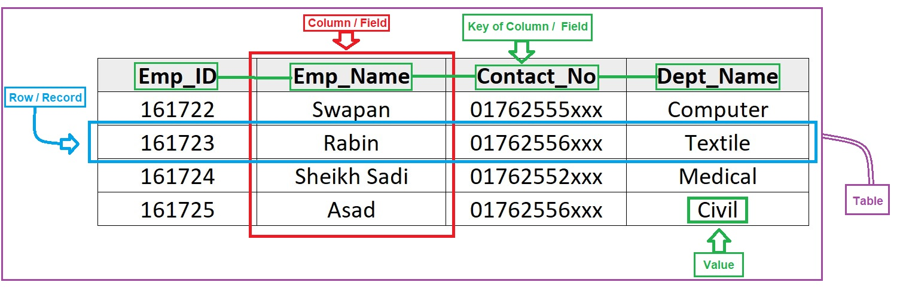
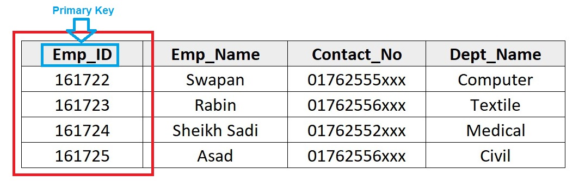
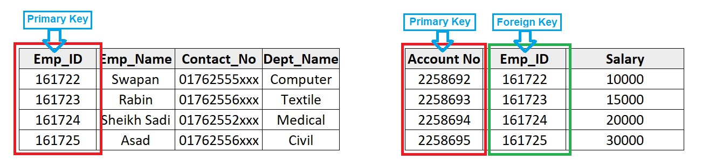
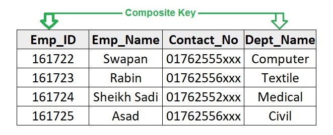
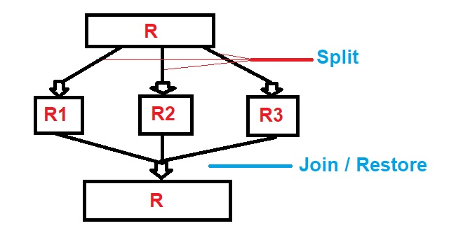

# Handnote of MySQL

MySQL ____ TAG | SYNTAX | REFERENCE

---

This note was created by [Muhammad S.A. Iqbal](https://github.com/msa-iqbal/) on October 4, 2020. (Last Update: August 23, 2024)

MySQL is a widely used open-source relational database management system (RDBMS) that relies on Structured Query Language (SQL) to manage and manipulate data.

# Essential Toolkit

```sql
[**❏**] **Requirements**:
     Applications: MySQL Installer [[view](https://dev.mysql.com/downloads/installer/)]

[**❏**] **URL**:
     -->> mysql.com (Official Site)
     
[**❏**] **Tutorial**
     -->> dev.mysql.com/doc
     -->> w3schools.com/sql
```

# Table of Notes

> Hellp Worlds
>
> dsds
>
> 

[TOC]

# |Hello World| sdsd

[hekkio]: https://github.com/msa-iqbal/Hand-Notes-by-Muhammad-SA-Iqbal	"Github"


[^Github]: hello


[^Linkedin]: Social emed

fds


$$
a2 + 2ab + b2 = (a+b)2
$$


| @ |  **Type** | **Tropic** |
| --- | --- | --- |
| A | **Start/ Introduction** | What is **MySQL/Data/Information**, Type of data/database, RDBMS, Normalization & Anomaly, Advantage/Disadvantage of RDBMS, Data Abstraction, Types of keys, OLAP vs OLTP, Data Sorting, Data Indexing, Query & Query Statements, Types of SQL Statement |
| B |  |  |
| C |  |  |
| D |  |  |
| E |  |  |
| F |  |  |

# ─「 SECTION [ A ] :: Start/ Introduction 」─

---

## **❏** Whats is MySQL ?

---

MySQL is a popular open-source relational database management system (RDBMS). It uses Structured Query Language (SQL) to manage and manipulate databases.



| `Column` = `Field` |
| --- |
| `Column_Name` = `Key_Attribute` |
| `Row` = `Record` = `Topple` |
| `Value` = `Data` |

**Properties of SQL statements**:

→ Not case sensitive.

→ A semicolon (`;`) must be placed at the end of the statement.

→ Statements can be broken into multiple lines.

Example:

```sql
CREATE DATABASE CompanyDB;

USE CompanyDB;

CREATE TABLE Employees (
    EmpID INT PRIMARY KEY AUTO_INCREMENT,
    FirstName VARCHAR(50),
    LastName VARCHAR(50),
    Department VARCHAR(50),
    Salary DECIMAL(10, 2),
    HireDate DATE
);
```

Here are some key points about MySQL:

- **Relational Database**: Organizes data into tables with rows and columns.
- **SQL Language**: Facilitates creating, reading, updating, and deleting database records.
- **Open Source**: Freely available for modification and distribution.
- **Cross-Platform**: Compatible with various operating systems, including Linux, Windows, and macOS.
- **Performance**: Known for speed, reliability, and ease of use, especially in web applications.
- **Scalability**: Capable of handling large datasets for both small and large-scale applications.
- **Security**: Offers features like user authentication, access control, and encryption.
- **Community and Support**: Backed by a large, active community and available commercial support.

## **❏ What is Data and Information ?**

---

**Data** is raw, unorganized, unprocessed information. E.g., the information collected for writing a research paper is data until it is presented in an organized manner.

**Information** is the processed, organized data that is beneficial in providing useful knowledge. For eg., the data compiled in an organized way in a research paper provides information about a particular concept/ topic.

**Data *vs* Information:**

| **Data** | **Information** |
| --- | --- |
| Data is unorganized and unrefined facts | Information comprises processed, organized data presented in a meaningful context |
| Data is an individual unit that contains raw materials which do not carry any specific meaning. | Information is a group of data that collectively carries a logical meaning. |
| Data doesn’t depend on information. | Information depends on data. |
| Raw data alone is insufficient for decision making | Information is sufficient for decision making |
| An example of data is a student’s test score | The average score of a class is the information derived from the given data. |

## **❏** What are the different types of data?

---

Data can be of two types:

- **Qualitative data:** It is non-numerical data. For eg., the texture of the skin, the color of the eyes, etc.
- **Quantitative data:** Quantitative data is given in numbers. Data in the form of questions such as “how much” and “how many”, gives the quantitative data.

## **❏ What is valid information?**

---

Valid information refers to data that is accurate, reliable, and applicable to the context in which it is used. For information to be considered valid, it typically needs to meet several criteria:

### **Criteria for Valid Information**

When determining whether information is valid, several criteria can be applied to ensure reliability and accuracy:

- **Accuracy**: Ensure information is correct, error-free, and verified by credible sources.
- **Reliability**: Depend on trustworthy sources that provide consistent information.
- **Relevance**: Use information that is pertinent to the context or purpose.
- **Completeness**: Provide all necessary details for full understanding.
- **Timeliness**: Use the most current information available.
- **Consistency**: Align with other reliable sources to avoid contradictions.
- **Objectivity**: Present information impartially, based on facts.
- **Source Credibility**: Rely on reputable, authoritative sources like peer-reviewed studies or official records.

Examples: Scientific data, official records, verified news, academic publications, business reports.

## **❏** Types of Databases

---

Databases come in various types, each tailored for specific use cases:

- **Relational Databases**: Use tables with foreign keys for structured data. Ideal for business applications, financial systems, and CRM (e.g., MySQL, PostgreSQL).
- **NoSQL Databases**: Handle unstructured data with no fixed schema. Types include:
    - **Document Stores**: JSON, BSON, or XML documents (e.g., MongoDB).
    - **Key-Value Stores**: Simple key-value pairs (e.g., Redis).
    - **Column Stores**: Data stored in columns (e.g., Cassandra).
    - **Graph Databases**: Nodes and edges for complex relationships (e.g., Neo4j).
    - **Use Cases**: Big data, real-time apps, and social networks.
- **Object-Oriented Databases**: Store data as objects, fitting complex data structures (e.g., db4o). Use in CAD and multimedia applications.
- **Distributed Databases**: Data spread across multiple locations for high availability (e.g., Google Spanner). Used in global e-commerce.
- **Graph Databases**: Focus on relationships using nodes and edges (e.g., Neo4j). Ideal for social networks and fraud detection.
- **Hierarchical Databases**: Tree-like structure with single parent-child relationships (e.g., IBM IMS). Used in directory services.
- **Network Databases**: More complex parent-child relationships than hierarchical (e.g., CA-IDMS). Used in telecommunications.
- **Time Series Databases**: Optimized for time-stamped data (e.g., InfluxDB). Used in IoT and real-time analytics.
- **Columnar Databases**: Data stored in columns for fast read operations (e.g., Apache HBase). Used in data warehousing.
- **Cloud Databases**: Delivered as a service with scalability and managed services (e.g., Amazon RDS). Used in scalable applications.

Each database type excels in different scenarios, so choosing the right one depends on your specific project needs.

## **❏ Relational Databases Management System (RDBMS)**

---

**RDBMS** is a database system that stores data in tables with rows and columns. These tables are linked using primary and foreign keys. It follows the relational model proposed by Codd. e.g., MySQL, PostgreSQL.

**Key Features of RDBMS**

- **Tables**:
    - **Structure**: Data is stored in tables with rows and columns.
    - **Schema**: Defines the table's structure, including column names, data types, and constraints.
- **Keys**:
    - **Primary Key**: Unique identifier for each row in a table.
    - **Foreign Key**: Links rows between tables, establishing relationships.
- **SQL (Structured Query Language)**:
    - **Queries**: Used for querying, inserting, updating, and deleting data.
    - **Transactions**: Ensures data integrity by grouping operations into a single unit of work.
- **ACID Properties**:
    - **Atomicity**: Transactions are all-or-nothing.
    - **Consistency**: Transactions bring the database from one valid state to another.
    - **Isolation**: Transactions operate independently.
    - **Durability**: Transaction results are permanent.
- **Normalization**:
    - **Process**: Organizes data to reduce redundancy.
    - **Normal Forms**: Levels from 1NF to 5NF, each reducing redundancy.
- **Relationships**:
    - **One-to-One**: One row in a table links to one row in another.
    - **One-to-Many**: One row links to multiple rows in another.
    - **Many-to-Many**: Multiple rows in both tables link, often via a junction table.

## **❏** Types of Keys in MySQL

---

In SQL, keys are used to identify and establish relationships between records in a database. Here are the various types of keys commonly used in SQL:

### Primary Key

A primary key is a field (or combination of fields) that uniquely identifies each record in a table. 

✍️ **Note**: The field or column that uniquely identifies each record is called the primary key.

Characteristics:

- Must contain unique values.
- Cannot contain NULL values.

Example: 

`EmployeeID` in an employee table.                                                          



### Foreign Key

A foreign key is a field (or combination of fields) in one table that uniquely identifies a row of another table.

✍️ **Note**: When the primary key of one table is used in another table, it is called a foreign key.

Characteristics:

- It creates a link between two tables.
- The foreign key in the child table refers to the primary key in the parent table.

Example: 

`Emp_ID` in an employee table referencing `Account_No` in a salary table.



### Unique Key

A unique key is a field (or combination of fields) that uniquely identifies each record in a table, similar to a primary key.

Characteristics:

- Must contain unique values.
- Can contain NULL values (only once per table).

Example: Email address in a user table.

### Composite Key

A composite key is a primary key composed of two or more fields.

✍️ **Note:** When a single field cannot uniquely identify each record, a composite key is created using multiple key fields to uniquely distinguish each record.

Characteristics:

- Used when a single field is not sufficient to uniquely identify a record.

Example: 

`Emp_ID` and `Dept_Name` together in an employee table.



### Candidate Key

A candidate key is a field (or combination of fields) that can uniquely identify a record in a table.

Characteristics:

- There can be multiple candidate keys in a table.
- One of these candidate keys is chosen as the primary key.

Example: In a employee table, both `Emp_ID` and `Contact_No` could be candidate keys.

### Super Key

A super key is a set of one or more fields that, together, uniquely identify a record in a table.

Characteristics:

- Includes all candidate keys and possibly additional fields.

Example: In an employee table, `Emp_ID` is a super key, and `EmployeeID` + `Phone_No` is also a super key.

### **Primary key *vs.* Foreign key**

| **Feature** | **Primary Key** | **Foreign Key** |
| --- | --- | --- |
| Purpose | Uniquely identifies each record in a table | Establishes a link between the records of two tables |
| Uniqueness | Must be unique | Can contain duplicate values |
| Null Values | Cannot contain NULL values | Can contain NULL values |
| Count per Table | Only one primary key per table | Can have multiple foreign keys per table |
| Data Integrity | Ensures the uniqueness and existence of each record | Ensures referential integrity between two tables |
| Creation | Defined using `PRIMARY KEY` constraint | Defined using `FOREIGN KEY` constraint |
| Modification | Values cannot change once set (in practice) | Values can change but must always match a value in the referenced table or be NULL |
| Relation | Parent Table | Child Table |

## **❏ Normalization & Anomaly of MySQL**

---

**❏ Data Redundancy in MySQL**

Redundancy refers to the unnecessary duplication of data within a database. 

**❏ Data Inconsistency in MySQL**

Data inconsistency occurs when the same data is stored in multiple places within a database, but the values do not match. This can lead to errors, confusion, and incorrect decision-making.

**❏ Redundancy *vs.* Inconsistency in MySQL**

|  | **Redundancy**  | **Inconsistency**  |
| --- | --- | --- |
| **Definition** | The unnecessary duplication of data within a database. | When different parts of the database hold conflicting information. |
| **Cause** | Data is stored in multiple places, often due to poor database design. | Often results from redundancy, partial updates, or concurrency issues. |
| **Impact** | Increases storage costs and the risk of inconsistency. | Leads to errors, unreliable data, and potential decision-making risks. |
| **Example** | Storing the same customer’s address in multiple tables. | One table shows a customer’s address as “123 Main St,” while another shows it as “456 Elm St.” |

**❏ Data Dependency in MySQL**

A dependency refers to the relationship between attributes (columns) in a database, guiding how data is organized and normalized.

Key Types of Dependencies:

- **Functional Dependency**: One attribute uniquely determines another (`A → B`).
- **Partial Dependency**: A non-key attribute depends on part of a composite key.
- **Transitive Dependency**: A non-key attribute depends on another non-key attribute (`A → B → C`).
- **Multi-valued Dependency**: One attribute determines multiple values of another.
- **Join Dependency**: A table can be split into smaller tables and re-joined without data loss.

Dependencies help reduce redundancy, ensure data integrity, and optimize database performance.

**❏ What is Decomposition? | Lossless & Lossy Join Decomposition**

Decomposition is the process of splitting a complex database table into smaller, simpler tables to eliminate redundancy and improve data integrity.



Types of Decomposition:

- **Lossless Join Decomposition**: Ensures that the original table can be perfectly reconstructed by joining the smaller tables without any loss of data.
- **Lossy Join Decomposition**: Results in data loss or the creation of spurious data when trying to reconstruct the original table.

**Lossless *vs.* Lossy Join Decomposition**:

| **Aspect** | **Lossless Join Decomposition** | **Lossy Join Decomposition** |
| --- | --- | --- |
| **Data Preservation** | Preserves all the original data | May lose or corrupt data |
| **Reconstruction** | Can perfectly reconstruct the original table using joins | May introduce incorrect or spurious data when reconstructing |
| **Condition** | Requires a common attribute with functional dependency | Does not guarantee proper relationships between attributes |
| **Mathematical Condition** | A decomposition is lossless if: `R1 ⨝ R2 ⨝ R3 .... ⨝ Rn = R` | A decomposition is lossy if: `R ⊂ R1 ⨝ R2 ⨝ R3 .... ⨝ Rn` |

## Anomalies in MySQL

Anomalies occur during data operations, leading to inconsistencies:

1. **Insertion Anomaly**: Inability to add data without unrelated data (e.g., adding a course without enrolling a student).
   
   
    | **StudentID** | **StudentName** | **CourseID** | **CourseName** |
    | --- | --- | --- | --- |
    | 1 | Abir | 101 | Math |
    | 2 | Bakul | 102 | Science |
2. **Update Anomaly**: Inconsistent data after partial updates (e.g., changing a course name in only some records).
   
   
    | **StudentID** | **StudentName** | **CourseID** | **CourseName** |
    | --- | --- | --- | --- |
    | 1 | Abir | 101 | Math |
    | 2 | Bakul | 101 | Math |
    | 3 | Diptp | 102 | Science |
3. **Deletion Anomaly**: Unintended data loss when deleting a record (e.g., losing course info when the last student drops the course).
   
   
    | **StudentID** | **StudentName** | **CourseID** | **CourseName** |
    | --- | --- | --- | --- |
    | 1 | Abir | 101 | Math |
    | 2 | Bakul | 101 | Math |

## Normalization as a Solution

Normalization resolves these anomalies by organizing data into tables and ensuring dependencies are correctly structured. Types of normalization

1NF up to 5NF is typically necessary in complex database systems like those used in traditional business applications and financial systems to ensure data integrity and efficiency. Here’s a breakdown from 1NF to 5NF with examples:

### **1st Normal Form (1NF)**

**Criteria:**

- In a column, multi-values not allowed.
- Every column will have a unique name.
- All data in a column will be of the same data type. and Its doesn’t matter in which order data is stored.
- Each record must be unique, ensuring there are no duplicate rows.

**Example:** 

Consider a table storing customer’s orders: 

| **OrderID** (Primary Key) | **CustomerName** | **ProductName** | **Quantity** |
| --- | --- | --- | --- |
| 1 | Abir | Laptop | 1 |
| 2 | Bakul | Mouse | 2 |
| 3 | Dipto | Keyboard, Mouse | 3 |

Normalization to 1NF:

We need to ensure that each value in the `ProductName` column is atomic (i.e., single-valued).

| **OrderID** (PK) | **CustomerName** | **ProductName** | **Quantity** |
| --- | --- | --- | --- |
| 1 | Abir | Laptop | 1 |
| 2 | Bokul | Mouse | 2 |
| 3 | Dipto | Keyboard | 1 |
| 4 | Sumit | Mouse | 2 |

Now, each column contains atomic values, and there are no duplicate rows, so this table is in 1NF.

### **2nd Normal Form (2NF)**

**Criteria:**

- The table must be in 1NF.
- All non-key attributes/column must be fully dependent on the primary key (no partial dependency).

✍️ **Note:** **Partial Dependency is that a non-key attribute depends on part of a composite key.

**Example:**

In this case, the original table has a composite key: `{CustomerID, OrderID}` because, `OrderID` is not unique per customer; that means there has been a partial dependency here. Now we need both columns to uniquely identify each record.

| **CustomerID** (PK) | **CustomerName** | **OrderID** (PK) | **ProductName** | **Quantity** |
| --- | --- | --- | --- | --- |
| 1 | Abir | 1 | Laptop | 1 |
| 2 | Bokul | 2 | Mouse | 2 |
| 3 | Dipto | 3 | Keyboard | 1 |
| 4 | Sumit | 4 | Mouse | 2 |

However, `CustomerName` only depends on `CustomerID`, not on the entire composite key. So, we need to separate the data into two tables:

Customers Table:

| **CustomerID** (PK) | **CustomerName** |
| --- | --- |
| 1 | Abir |
| 2 | Bokul |
| 3 | Dipto |
| 4 | Sumit |

Finally, ****Orders Table:

| **OrderID** (PK) | **CustomerID** (PK) | **ProductName** | **Quantity** |
| --- | --- | --- | --- |
| 1 | 1 | Laptop | 1 |
| 2 | 1 | Mouse | 2 |
| 3 | 2 | Keyboard | 1 |
| 4 | 2 | Mouse | 2 |

Explanation:

- Customer Table: It’s keeps `CustomerID` and `CustomerName` because `CustomerName` only depends on `CustomerID`.
- Order Table: It’s stores details about orders, including `OrderID`, `CustomerID` (which acts as a foreign key), `ProductName`, and `Quantity`.

Now, there are no partial dependencies, and the data is in 2NF.

### 3rd Normal Form (3NF)

**Criteria:**

- The table must be in 2N F.
- All non-key attributes/column should be dependent only on the primary key (no transitive dependency).

✍️ **Note:** **Transitive Dependency is that a non-key attribute depends on another non-key attribute.

**Example:**

If we add a `ProductPrice` to the `Orders` table:

| **OrderID** (PK) | **CustomerID** (PK) | **ProductName** | **Quantity** | **ProductPrice** |
| --- | --- | --- | --- | --- |
| 1 | 1 | Laptop | 1 | 1000 |
| 2 | 1 | Mouse | 2 | 25 |
| 3 | 2 | Keyboard | 1 | 50 |
| 4 | 2 | Mouse | 2 | 25 |

Here, `ProductPrice` depends on `ProductName`, not directly on the `OrderID`, which is a transitive dependency. To move to 3NF, we create a separate `Products` table:

Products Table:

| **ProductID** (PK) | **ProductName** | **ProductPrice** |
| --- | --- | --- |
| 1 | Laptop | 1000 |
| 2 | Mouse | 25 |
| 3 | Keyboard | 50 |

Finally, ****Orders Table:

| **OrderID** (PK) | **CustomerID** (PK) | **ProductID** (PK) | **Quantity** |
| --- | --- | --- | --- |
| 1 | 1 | 1 | 1 |
| 2 | 1 | 2 | 2 |
| 3 | 2 | 3 | 1 |
| 4 | 2 | 2 | 2 |

Now, the `Orders` table is in 3NF because there are no transitive dependencies.

### Boyce-Codd Normal Form (BCNF)

**Criteria:**

- The table must be in 3NF.
- A key attribute/column cannot have a dependency on any other non-key attribute/column.  For every functional dependency (`A → B`), `A` should be a super key.

✍️ **Note:** **Functional dependency is that one attribute uniquely determines another `(A → B)`*.*

**Example:**

Consider a scenario where a single professor teaches a single subject, but multiple professors can teach the same subject:

| **Student_ID** (PK) | **Professor** | **Subject** | **Department** |
| --- | --- | --- | --- |
| 1601 | Dr. Smith | Math | Science |
| 1602 | Dr. Jones | Physics | Humanities |
| 1603 | Dr. Wick | Physics | Science |

Here, both `Professor` and `Subject` can be used to determine `Department`, so the table is not in BCNF. To move to BCNF, we need to separate the dependencies:

Professors Table:

| **Professor_ID** (PK) | **Professor** | **Subject** | **Department** |
| --- | --- | --- | --- |
| 261 | Dr. Smith | Math | Science |
| 262 | Dr. Jones | Physics | Humanities |
| 263 | Dr. Wick | Physics | Science |

Finally, Student Table:

| **Student_ID** (PK) | **Professor_ID** (PK) |
| --- | --- |
| 1601 | 261 |
| 1602 | 262 |
| 1603 | 263 |

Now, the tables are in BCNF.

Explain: 

- In the `Professors` table, `Professor_ID` is a superkey, and it uniquely determines all other attributes.
- In the `Students` table, `Student_ID` is a superkey, and it determines `Professor_ID`.

This decomposition removes any functional dependencies that violate BCNF, ensuring the database is well-normalized and free of redundancy and anomalies.

### 4th Normal Form (4NF)

**Criteria:**

- The table must be in BCNF.
- There should be no multi-valued dependencies (one column should not imply multiple values in another column independently).

**Example:**

If a table records subjects taught by professors and books used for each subject:

| **Professor** | **Subject** | **Book** |
| --- | --- | --- |
| Dr. Smith | Math | Calculus |
| Dr. Smith | Math | Algebra |
| Dr. Smith | Physics | Mechanics |
| Dr. Jones | History | World War |

In this table, `Subject` and `Book` are independent of each other regarding `Professor`. For example, Dr. Smith teaches both Math and Physics, and Math uses two books, but these two pieces of information are independent. This results in **redundancy** since there are repeated rows for each book associated with a subject. We need to split this table into two separate relations to remove the multi-valued dependency:

ProfessorSubjects Table:

| **Professor** | **Subject** |
| --- | --- |
| Dr. Smith | Math |
| Dr. Smith | Physics |
| Dr. Jones | History |

SubjectBooks Table:

| **Subject** | **Book** |
| --- | --- |
| Math | Calculus |
| Math | Algebra |
| Physics | Mechanics |
| History | World War |

Now, the tables are in 4th Normal Form (4NF). because the multi-valued dependencies have been removed.

Explain:

- The `ProfessorSubjects` table associates professors with the subjects they teach.
- The `SubjectBooks` table lists books associated with each subject.

This design eliminates the redundancy and ensures no anomalies during data updates or deletions.

### 5th Normal Form (5NF) | Lossless & Lossy Join Decomposition

**Criteria:**

- The table must be in 4NF.
- A table is in 5NF if it cannot be further decomposed without **loss of information** (lossless join).
- Every join dependency in the table must be implied by the candidate keys.

**Example:**

Suppose a company manages contracts, and each contract can involve multiple companies, employees, and products:

| **ContractID** | **Company** | **Employee** | **Product** |
| --- | --- | --- | --- |
| 1 | Company A | John | Laptop |
| 1 | Company A | John | Mouse |
| 1 | Company B | Alice | Laptop |
| 2 | Company A | Jane | Keyboard |

To move to 5NF, we break it down into three tables, each representing a relationship between pairs:

**ContractCompanies Table:**

| **ContractID** | **Company** |
| --- | --- |
| 1 | Company A |
| 1 | Company B |
| 2 | Company A |

**ContractEmployees Table:**

| **ContractID** | **Employee** |
| --- | --- |
| 1 | John |
| 1 | Alice |
| 2 | Jane |

**ContractProducts Table:**

| **ContractID** | **Product** |
| --- | --- |
| 1 | Laptop |
| 1 | Mouse |
| 2 | Keyboard |

**Lossless Join Process:**

First, join the **ContractCompanies** table with the **ContractEmployees** table using the `ContractID` and then join this result with the **ContractProducts** table using the `ContractID`

Finally, result will be:

| **ContractID** | **Company** | **Employee** | **Product** |
| --- | --- | --- | --- |
| 1 | Company A | John | Laptop |
| 1 | Company A | John | Mouse |
| 1 | Company B | Alice | Laptop |
| 2 | Company A | Jane | Keyboard |

Now, these tables are in 5NF or lossless join decomposition, as they eliminate redundancy and ensure that each relationship is represented without unnecessary joins.

## **❏** Types of Database Relation

---

In SQL databases, relationships define how tables relate to each other.

- **One-to-One (1:1) Relationship:** A single row in one table is linked to a single row in another table.
- **One-to-Many (1:M) Relationship:** A single row in one table is linked to multiple rows in another table.
- **Many-to-One (M:1) Relationship:** Many rows in one table are linked to a single row in another table.
- **Many-to-Many (M:M) Relationship:** Multiple rows in one table are related to multiple rows in another table.

## **❏** Data Sorting and Indexing in MySQL

---

Data sorting and indexing are crucial techniques for optimizing the performance of SQL databases. 

### **Data Sorting**

Arranges query results in a specific order (ascending or descending) based on one or more columns. 

**Note:** Sorting is generally not done on the following SQL fields:

- **MEMO:** Large text fields can be costly to sort and may not yield meaningful results.
- **Hyperlink:** Sorting URLs or paths doesn't usually provide useful results.
- **OLE Fields:** Sorting embedded objects like images or documents is complex and often impractical.

Keyword: `ORDER BY`

Example:

```sql
SELECT * FROM Employees
ORDER BY LastName ASC, FirstName DESC;
```

### **Data Indexing**

Improves query performance by allowing the database to quickly locate and retrieve rows from a table.

Keyword: `CREATE INDEX`

Example:

```sql
CREATE INDEX idx_lastname ON Employees(LastName);
```

### **Data Sorting *vs* Data Indexing**

| **Data Sorting** | **Data Indexing** |
| --- | --- |
| Sorting is the process of arranging the records in a data table according to a specified field. | Indexing organizes records in a data table by a specified field while keeping the original table unchanged. |
| In Sorting, a separate sorted file is created in the database. | The index file contains no records, only the logical order. |
| Indexing does alter/change the serial order of records in the original data file. | Indexing does not alter/change the serial order of records in the original data file. |
| If a record is modified or added to the database, the sorted file is not automatically updated. | In a database, the index file is automatically updated when records are modified or added. |
| Sorting records typically requires a comparatively longer time. | Indexing requires less time for sorting. |
| Sorting requires more memory. | Indexing requires less memory. |

## **❏** Data Security

---

Data Security in SQL involves measures to protect data from unauthorized access, breaches, and other threats. Key aspects include:

- **Authentication**: Verifies the identity of users accessing the database.
- **Authorization**: Controls what authenticated users are allowed to do.
- **Encryption**: Protects data by converting it into a secure format.
- **Data Masking**: Hides sensitive data by obfuscating it.
- **Auditing**: Tracks and logs database activities.
- **Backup and Recovery**: Ensures data is regularly backed up and can be restored in case of loss or corruption.
- **SQL Injection Prevention**: Protects against attacks that exploit vulnerabilities in SQL queries.
- **Access Control**: Restricts database access based on user roles.

## **❏** Advantages of an RDBMS

---

**Data Integrity and Accuracy:**

- **Constraints:** Enforces data integrity with primary keys, foreign keys, unique, and check constraints.
- **ACID Properties:** Guarantees atomicity, consistency, isolation, and durability for accurate and reliable transactions.

**Data Security:**

- **Access Control:** Ensures security through user authentication, authorization, and roles.
- **Encryption:** Protects data at rest and in transit.

**Data Consistency:**

- **Normalization:** Organizes data to minimize redundancy and ensure consistency.
- **Referential Integrity:** Maintains valid relationships between tables.

**Structured Query Language (SQL):**

- **Powerful Querying:** Enables complex data manipulation.
- **Portability:** Widely accepted, making it easy to transfer skills across platforms.

**Data Independence:**

- **Physical Independence:** Physical storage changes don't affect logical schema.
- **Logical Independence:** Logical schema changes don't impact user views or apps.

**Backup and Recovery:**

- **Automated Backup:** Regular data backups with easy restoration.
- **Recovery Mechanisms:** Tools for quick data recovery and minimal loss.

**Concurrency Control:**

- **Multi-User Support:** Ensures integrity during simultaneous access.
- **Isolation Levels:** Balances performance and consistency.

**Scalability:**

- **Vertical Scalability:** Handles growing workloads by upgrading hardware.
- **Optimization:** Enhances performance through indexing, query optimization, and partitioning.

**Data Abstraction:**

- **Levels of Abstraction:** Simplifies management with physical, logical, and view levels.
- **Views:** Custom data presentations without altering underlying tables.

**Data Sharing:**

- **Shared Database:** Promotes collaboration by enabling data sharing across apps.
- **Integration:** Easily integrates with other systems through APIs and interfaces.

**Example Scenarios:**

**Financial Systems:** Ensures secure, reliable transaction processing in banking.

**Healthcare Systems:** Manages patient records with robust security and backups.

**E-commerce Platforms:** Handles inventory, customer info, and orders with scalability and concurrency.

**Government Databases:** Manages citizen data with a focus on accuracy and security.

## **❏** Disadvantages of an RDBMS

---

**Complexity:**

- **Schema Design:** Requires deep knowledge of data relationships and normalization.
- **Maintenance:** Ongoing schema updates and query optimization are time-consuming.

**Performance:**

- **Scalability:** Struggles with horizontal scaling, less ideal for large-scale apps.
- **Read/Write:** May underperform in high read/write scenarios compared to NoSQL.

**Cost:**

- **Licensing:** Commercial RDBMS can be costly.
- **Hardware:** Requires robust hardware, increasing expenses.

**Flexibility:**

- **Rigid Schema:** Less adaptable to changing data needs, complex to alter.
- **Data Types:** Enforces strict data types, limiting flexibility.

**Unstructured Data:**

- **Handling:** Less suited for unstructured or semi-structured data like JSON or multimedia.

**Complex Transactions:**

- **Distributed Transactions:** Challenging to manage across distributed systems.

**Development Time:**

- **Time-Consuming:** Requires detailed schema design and optimization.

**SQL Dependency:**

- **Learning Curve:** SQL can be complex for new developers.
- **Variations:** Differences among RDBMSs can cause compatibility issues.

**Concurrency:**

- **Locking Issues:** High concurrency can lead to locking and performance problems.

**Backup & Recovery:**

- **Complex Procedures:** Configuring for large databases can be challenging.

**Example Scenarios**:

**High Volume Data:** Real-time data streaming apps may face performance issues.

**Flexible Models:** RDBMSs struggle with rapidly evolving data models.

**Large Web Apps:** Web apps needing horizontal scaling and unstructured data handling may prefer NoSQL.

## **❏** OLAP vs OLTP

---

**OLTP (Online Transaction Processing)**: Handles real-time transactions, such as online purchases, banking transactions, and inventory updates.

**OLAP (Online Analytical Processing)**: It is designed for complex data analysis and reporting.

## **❏ What is Data Abstraction in a MySQL**

---

Data abstraction in DBMS hides database complexity by providing simplified views. It has three levels:

1. **Physical Level:**
    - **Focus:** How data is physically stored.
    - **Audience:** DBAs and system architects.
2. **Logical Level:**
    - **Focus:** Data organization and relationships.
    - **Audience:** Designers and developers.
3. **View Level:**
    - **Focus:** User-specific views.
    - **Audience:** End-users and application developers.

**Benefits:**

- Simplifies user interaction.
- Ensures data independence and security.
- Enhances system flexibility for updates and maintenance.

## **❏ Query in MySQL**

---

A query in the context of databases is a request for data or information from a database.

Here’s an overview of the different types of SQL queries:

- Select Query
- Parameter Query
- Crosstab Query
- Unmatched Query
- Action Query

### **Select Query**

In SQL query, retrieves data from one or more tables based on specified criteria.

Criteria:

- Can filter, sort, and display data from tables.
- Can include conditions using `WHERE`, grouping with `GROUP BY`, and sorting with `ORDER BY`.

Example**:**

```sql
SELECT FirstName, LastName, Department
FROM Employees
WHERE Department = 'Sales'
ORDER BY LastName ASC;
```

### Parameter Query

In SQL query, prompts the user to input a value before the query is executed, allowing for dynamic filtering.

Criteria:

- Useful for queries that need user input to filter data.
- Often used in applications or reports where the user specifies criteria at runtime.

Example:

```sql
SELECT * FROM Employees
WHERE Department = @DepartmentName;

-- Here, @DepartmentName would prompt the user to input a department name. 
```

### Crosstab Query

In SQL query, summarizes data in a matrix format, displaying data in a two-dimensional grid where one set of data is listed across the top, and another set down the side.
Criteria:

- Typically used for summarizing data (e.g., totals, averages).
- The data is grouped by rows and columns, often using aggregate functions like `SUM`, `COUNT`, `AVG`.

Example:

```sql
SELECT Department, COUNT(EmpID) AS EmployeeCount
FROM Employees
GROUP BY Department
PIVOT Department;

/* This query would show departments as columns and the number of 
   employees in each department as the data.*/
```

### Unmatched Query

In SQL query, identifies records in one table that do not have corresponding records in another related table.

Criteria:

- Useful for finding orphaned records or missing relationships between tables.

Example:

```sql
SELECT Customers.CustomerID, Customers.CustomerName
FROM Customers
LEFT JOIN Orders ON Customers.CustomerID = Orders.CustomerID
WHERE Orders.CustomerID IS NULL;

-- This query finds customers who have no orders.
```

### **Action Query**

In SQL query, performs actions on the data such as inserting, updating, deleting, or making new tables.

Types of Action Query:

- **Make-Table Query**: Creates a new table from the results of a query.
- **Append Query**: Adds records to an existing table.
- **Update Query**: Modifies existing records.
- **Delete Query**: Removes records from a table.

Example:

```sql
-- Example: Make-Table Query
SELECT FirstName, LastName INTO NewEmployeesTable
FROM Employees
WHERE Department = 'Marketing';

-- Example: Update Query
UPDATE Employees
SET Salary = Salary * 1.10
WHERE Department = 'Sales';

-- Example: Delete Query
DELETE FROM Employees
WHERE TerminationDate < '2024-01-01';
```

## **❏ Types of SQL Statement**

---

SQL queries are commands used to interact with databases, allowing you to manage data.

Types of SQL Queries:

- Data Query Language (DQL)
- Data Definition Language (DDL)
- Data Manipulation Language (DML)
- Data Control Language (DCL)
- Transaction Control Language (TCL)

### Data Query Language (DQL)

**Purpose:** To retrieve data from a database.

**Usage:** Fetches records based on specified conditions.

**Key Command:** `SELECT`

Example:

```sql
SELECT * FROM Employees WHERE Department = 'Sales';
```

### Data Definition Language (DDL)

**Purpose:** To define and manage database schema and structure.
**Key Commands**: 

`CREATE` – Creates tables, indexes, databases, etc.

`ALTER` – Modifies an existing database object (e.g., add a column).

`DROP` – Deletes tables, indexes, or databases.

Example:

```sql
CREATE TABLE Employees (
    EmpID INT PRIMARY KEY,
    FirstName VARCHAR(50),
    LastName VARCHAR(50)
);
```

### Data Manipulation Language (DML)

**Purpose**: To manipulate the data stored in a database.

**Key Commands:**

`INSERT` – Adds new records to a table.

`UPDATE` – Modifies existing records in a table.

`DELETE` – Removes records from a table.

Example:

```sql
INSERT INTO Employees (EmpID, FirstName, LastName)
VALUES (1, 'John', 'Doe');
```

### Data Control Language (DCL)

**Purpose:** To control access to data in a database.
**Key Commands:**

`GRANT` – Gives user access privileges to the database.

`REVOKE` – Removes user access privileges.

Example: 

```sql
GRANT SELECT ON Employees TO UserName;
```

### **Transaction Control Language (TCL)**

**Purpose**: To manage transactions within a database.

**Key Commands**:

`COMMIT` – Saves all changes made during the transaction.

`ROLLBACK` – Reverts changes made during the transaction.

`SAVEPOINT` – Sets a point within a transaction to which you can roll back.

Example:

```sql
BEGIN TRANSACTION;
UPDATE Employees SET Salary = Salary * 1.10 WHERE Department = 'Sales';
COMMIT;
```